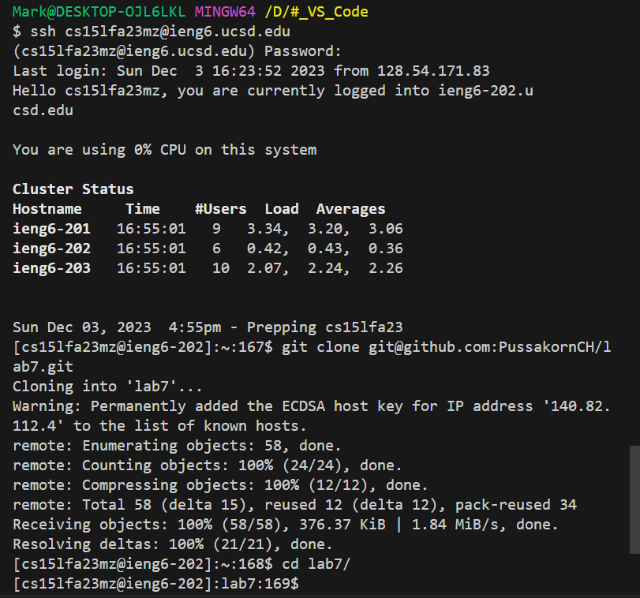
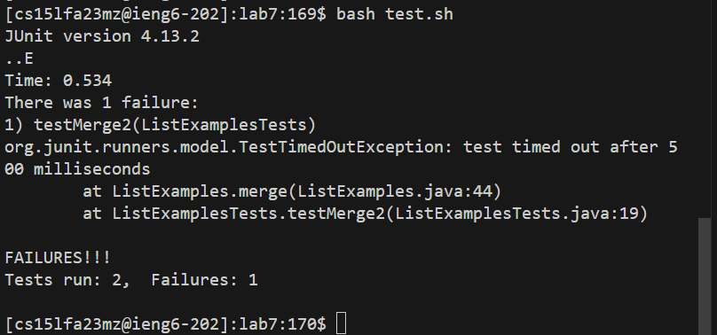
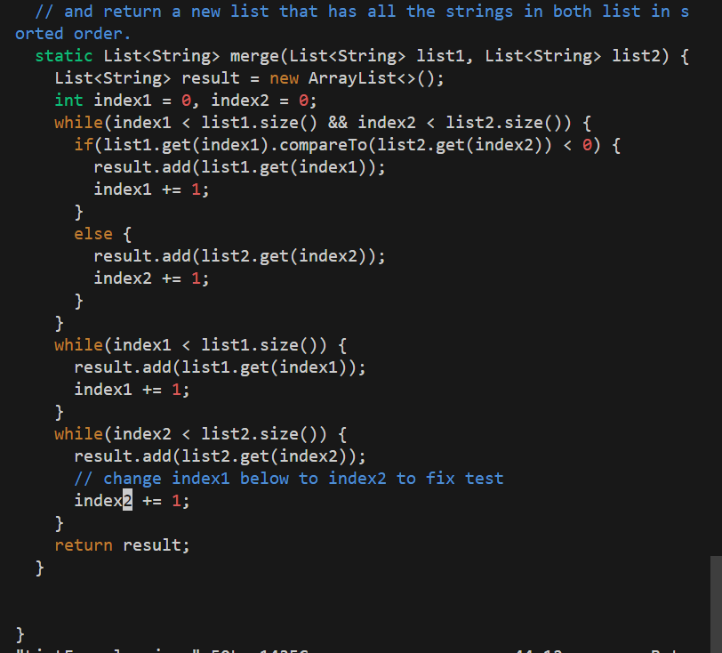
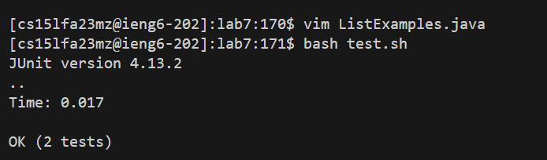
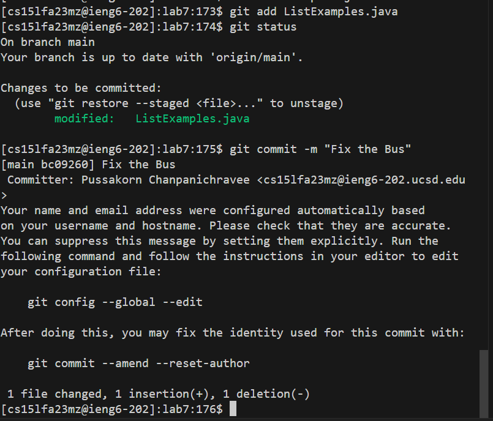
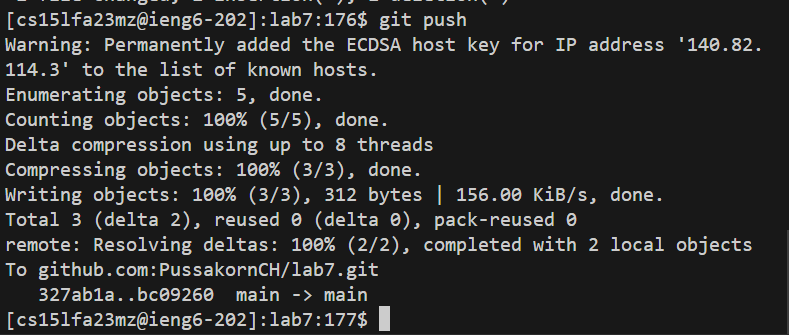
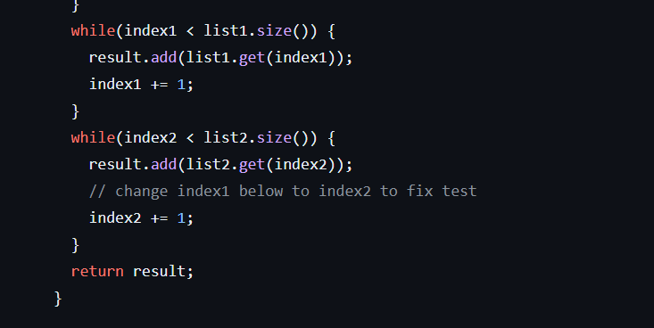

# Lab Report 4 - Vim (Week 7)

[live_page_for_GitHub](https://pussakornch.github.io/cse15l-lab-reports3/lab-report.html)

## I will write up step and show the screenshot
## Keypress: in () and commend behind //

(up) (enter) // to find ssh command from 1 line up

cd l (tap)   // use tap to make shortcut

bash test.sh

vim ListExamples // to access the Java file

(/change) (enter) // use "/" to search

(j) (l)(l) (x) // to move to "index1"  and remove 1

(i) 2 (ESC) //  insert mode and replace 1 with 2 then exit insert mode

(:wq) // = save and quit the vim.

bash test.sh // test the  success file

// I just Typing the command

git add ListExamples.java

git status

git commit -m "Fix the Bus"

git push

// This is the result of the change in GitHub 
